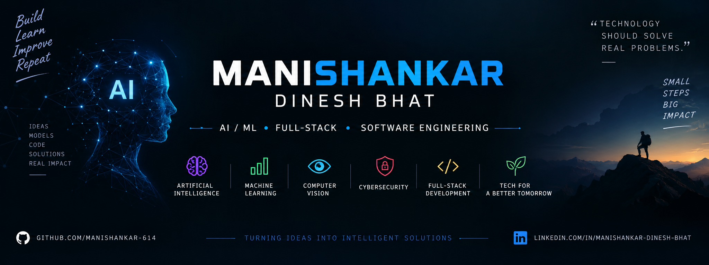

  

# 👋 Hi, I'm Manishankar

### 🤖 AI/ML Developer | Full-Stack Developer | Software Engineer

I build practical software solutions by combining **Artificial Intelligence, Machine Learning, Deep Learning, and modern web technologies**.

I'm passionate about learning through building and turning real-world problems into useful, intelligent applications.

---

## 🚀 About Me

- 🎓 Computer Science Engineering Student
- 🤖 Interested in **Artificial Intelligence & Machine Learning**
- 🧠 Exploring **Deep Learning, NLP & Computer Vision**
- 🔐 Interested in **AI-powered Cybersecurity**
- 🌱 Interested in applying AI to **Agriculture & Healthcare**
- 💻 Building applications with **Python, Flask, React & JavaScript**
- 🗄️ Working with **MongoDB, MySQL & SQLite**
- 🚀 Constantly learning, experimenting and building

---

## 🛠️ Tech Stack

### 💻 Languages

  

### 🤖 AI / Machine Learning

  

`TensorFlow` `Keras` `Scikit-Learn` `Pandas` `NumPy`

**Areas:** Machine Learning • Deep Learning • Computer Vision • NLP • Classification • Anomaly Detection

### 🌐 Web Development

  

### 🗄️ Databases

  

### 🔧 Tools & Platforms

  

---

## 🔥 Featured Projects

### 🛡️ Phishing Detection

**AI-powered cybersecurity system for detecting phishing threats.**

A machine-learning based project focused on identifying malicious and suspicious URLs and phishing attacks.

**Focus:** `Machine Learning` `Deep Learning` `Cybersecurity` `NLP` `Anomaly Detection`

🔗 [View Repository](https://github.com/Manishankar-614/phishing_detection)

---

### 🌱 Plant Disease Detection

**Deep-learning based plant disease detection using computer vision.**

An AI-based system that analyzes plant leaf images to identify diseases and demonstrates the application of deep learning in agriculture.

**Focus:** `Deep Learning` `Computer Vision` `CNN` `TensorFlow` `Keras`

🔗 [View Repository](https://github.com/Manishankar-614/Plant_Disease_Detection)

---

### 🌐 Personal Portfolio

**My personal developer portfolio.**

A web-based portfolio showcasing my projects, technical skills and development journey.

**Focus:** `Web Development` `HTML` `CSS` `JavaScript`

🔗 [View Repository](https://github.com/Manishankar-614/My_Portfolio)

---

### 🎬 Movie Review

**Web-based movie review application.**

A web application developed to explore movie information and review functionality while applying full-stack development concepts.

**Focus:** `Web Development` `Flask` `SQLite` `JavaScript`

🔗 [View Repository](https://github.com/Manishankar-614/movie-review)

---

## 🧠 Areas of Interest

- 🤖 Artificial Intelligence
- 🧠 Machine Learning & Deep Learning
- 👁️ Computer Vision
- 💬 Natural Language Processing
- 🔐 AI-powered Cybersecurity
- 🌱 AI for Agriculture
- 🏥 AI for Healthcare
- 🌐 AI-integrated Web Applications

---

## 🚧 Currently Exploring

- 🤖 Artificial Intelligence & Machine Learning
- 🧠 Deep Learning & Computer Vision
- 🔐 AI-powered Cybersecurity
- 🌐 AI-integrated Web Applications
- ☁️ Deployment of ML-powered applications

---

## 📊 GitHub Stats

## 📊 GitHub Stats

  
  

---

## 🔥 Contribution Streak

  

---

## 🐍 Contribution Snake

  

---

## 🎯 My Goal

> **Build intelligent software that solves real-world problems.**

I'm continuously improving my skills in **AI, Machine Learning, Full-Stack Development and Software Engineering** while building projects that combine technology with practical real-world applications.

---

## 🤝 Let's Connect

---

  ⭐ <b>Thanks for visiting my profile!</b>

